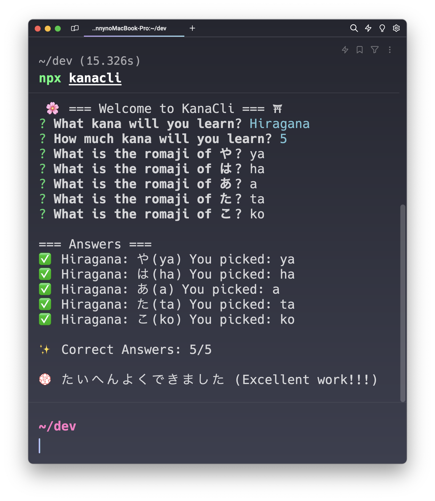

# 🌸 Welcome to KanaCli ⛩️

[](https://www.npmjs.com/package/kanacli)
[](#)
[](https://twitter.com/daikiejp)

> CLI for learn Hiragana and Katana.



### 🏠 [Homepage](https://github.com/daikiejp/kanacli)

## Install

```sh
npx kanacli
```

## Status

We are currently updating. Stay tuned.

## Latest version:

v0.1.1 (alpha version)

## Author

👤 **Danny Davila**

- Website: [https://daikie.jp](daikie.jp)
- X (formely Twitter): [@daikiejp](https://twitter.com/daikiejp)
- Github: [@daikiejp](https://github.com/daikiejp)

## License

MIT License
